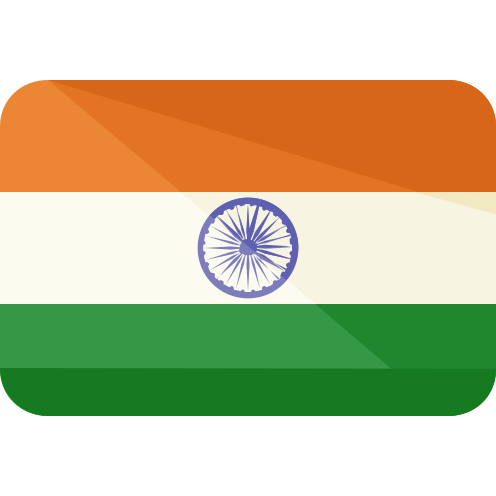

<link rel="preconnect" href="https://fonts.gstatic.com">
<link href="https://fonts.googleapis.com/css2?family=Kaushan+Script&display=swap" rel="stylesheet"> 

    

        

            Hey, 👋 I'm Vishal
        

    

    <h1>A Competitive Coder and a Full Stack Web Developer</h1>
    <h2>Pursuing my Bachelor's from Lovely Professional University</h2>    
    <h3>🇮🇳</h3>

<h2 style="font-family:Consolas">CHECKOUT MY BLOGS</h2>

<h2 style="font-family:Consolas">GET IN TOUCH</h2>

<link rel="import" href="https://github.com/Vishal023">

 

    

        

            It always seems impossible until it's done.
        

    

